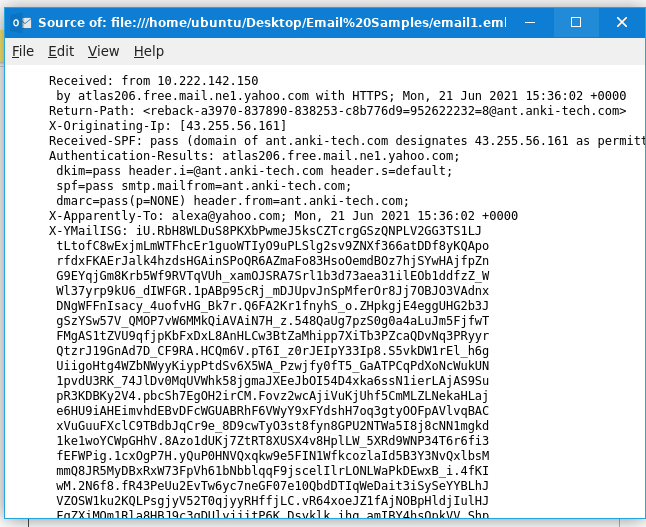
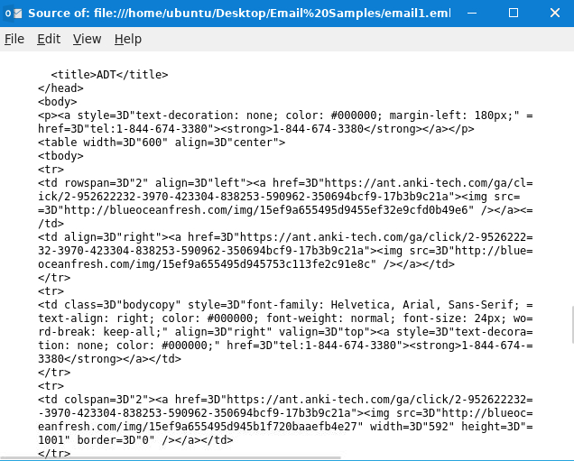
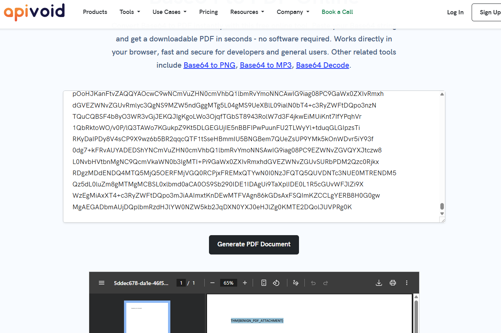
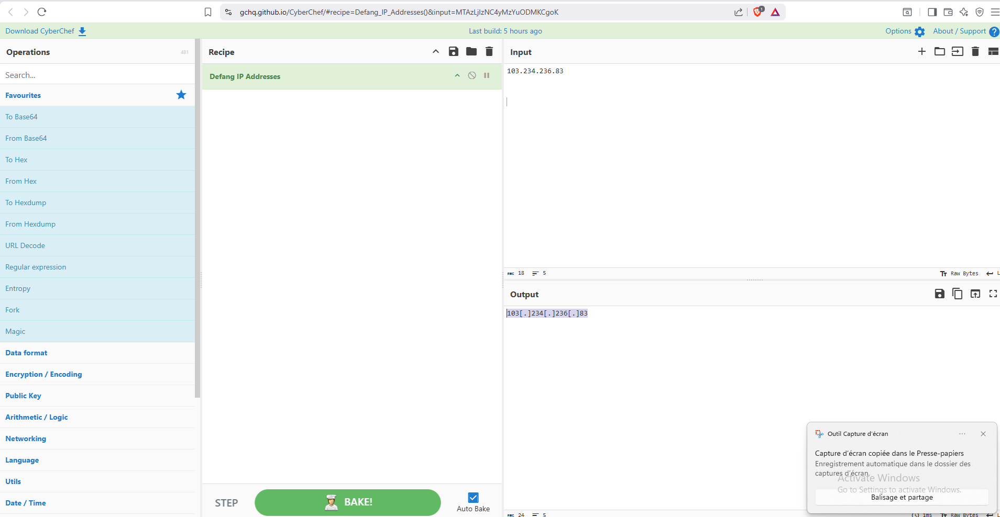

# TryHackMe — Phishing Analysis Fundamentals

> **Room:** Phishing Analysis Fundamentals  
> **Platform:** TryHackMe  
> **Category:** Security Operations / Phishing Analysis  

---

## Introduction

This room covers the anatomy of an email — how it is structured, which protocols it follows, and how it travels from sender to recipient. Thunderbird is used for deeper analysis of potential phishing emails.

This room is relevant to SOC work because email is the most common entry point for threat actors. Understanding what an email actually contains beyond what is visible is a core analyst skill.

---

## Email Structure

An email address consists of two parts:

| Part | Description |
|---|---|
| **Username** | Identifies the recipient's mailbox on the mail server |
| **Domain name** | Specifies which mail server is responsible for that mailbox |

---

## Email Protocols

The receiving mail server uses one of the following protocols depending on how the mailbox is configured:

### POP3
- Emails downloaded and stored on a **single device**
- Deleted from the server after download
- Only accessible from that one device
- Better suited for offline use and privacy

### IMAP
- Emails stored **on the server**
- Accessible from multiple devices
- Synchronizes across all connected devices
- Standard in business environments with shared mailbox access

> **Attacker perspective:** IMAP is the more valuable target. Emails remain on the server, so a compromised account gives persistent access to the full mailbox history. With POP3, emails are removed from the server after download — significantly reducing what an attacker can retrieve.

---

## Raw Source Analysis

Standard email headers show sender, recipient, subject, and timestamp. The raw source reveals significantly more — routing data, server hops, encoding metadata, and hidden header fields.

### Viewing raw source in Thunderbird

```
View → Message Source
```



From the raw source, the **originating IP address** (`X-Originating-IP`) is visible — a key field when investigating phishing emails that is not shown in the default view.

---

## Email Body Analysis

Emails are sent as either **plain text** or **HTML**. HTML supports images, links, and rich formatting — which also makes it a common vector for hiding malicious content.

The body source is accessible the same way as the headers:

```
View → Message Source
```

> Thunderbird blocks remote images from loading by default — this prevents tracking pixels from firing when opening a suspicious email.

### What to look for in the HTML source

- **Hyperlinks** — visible text may differ from the actual `href` destination
- **Attachments** — embedded as base64 strings, extractable for further analysis



---

## Base64 & Attachments

All email attachments are encoded as **base64**. This is not obfuscation — SMTP was designed for plain text, so binary files (PDFs, executables, images) must be converted to ASCII to travel over the protocol.

Malicious attachments are embedded the same way as legitimate ones. Extracting and decoding a base64 string from raw source is a standard first step in attachment analysis.



---

## Phishing Indicators

Phishing emails share common characteristics regardless of type (spam, spear phishing, vishing, smishing):

| Indicator | Example |
|---|---|
| **Urgent subject or message** | "Your account will be locked in 24 hours" |
| **Brand impersonation** | Logos and colors mimicking a legitimate organization |
| **Grammar & spelling issues** | Awkward phrasing — less reliable now due to AI-generated phishing |
| **Generic content** | "Dear Customer" instead of the recipient's name |
| **Hidden or shortened links** | `bit.ly/secure-login` masking a malicious destination |
| **Malicious attachments** | Files disguised as legitimate documents (`invoice.pdf.exe`) |

---

## Practical Tasks

### Identifying a spoofed organization

The task required identifying which organization was being impersonated. The answer was visible in the email header — the sender domain did not match the organization it claimed to be from.

### Defanging the X-Originating-IP

**Steps:**
1. Open the email in Thunderbird → `View → Message Source`
2. Locate the `X-Originating-IP` field in the raw headers
3. Copy the IP into **CyberChef** → apply **Defang IP Addresses**



Defanging is standard practice when documenting IOCs — it prevents accidental execution or clicks on malicious content in reports.

---

## Key Takeaways

- Raw source analysis reveals data that is invisible in the standard email view — essential for phishing investigation
- IMAP carries higher risk than POP3 from an attacker's perspective due to persistent server-side storage
- Base64 is how all email attachments are transmitted, not a form of obfuscation — understanding this is required for attachment analysis
- Thunderbird's Message Source view and CyberChef are practical tools for manual email forensics
- Recognizing common phishing indicators is foundational for SOC work

---

*Written as part of my cybersecurity learning journey on TryHackMe. This writeup documents my personal workflow and understanding.*
