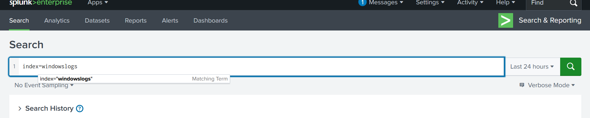
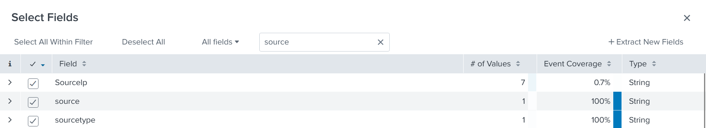
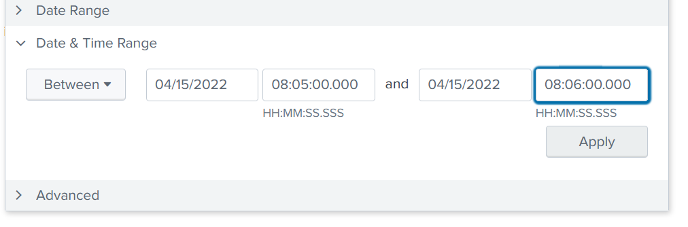
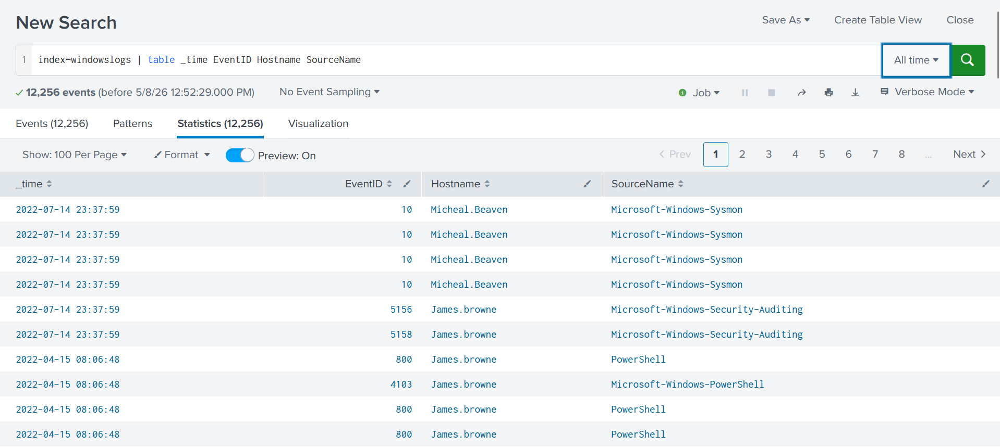
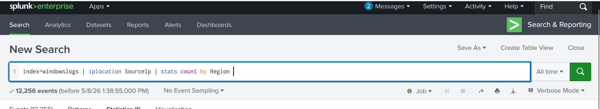

# TryHackMe — Splunk: Exploring SPL

> **Room:** Splunk: Exploring SPL  
> **Platform:** TryHackMe  
> **Category:** Security Operations / SIEM  

---

## Introduction

This writeup continues from my previous Splunk room. I focus on this topic because working in a SOC as an analyst means working with Splunk on a daily basis. Understanding SPL (Search Processing Language) is a core skill for log analysis, threat hunting, and incident response.

All queries in this room use the `windowslogs` index, as the room focuses on Windows event logs.

---

## Task 1 — Basic Search & Event Count

The first task required retrieving all events from the `windowslogs` index and checking the total number of logs across all time.

```spl
index=windowslogs
```



---

## Task 2 — Finding the SourceIP with the Most Events

To find which source IP had the most recorded events, I used the sidebar in Splunk. By clicking **"More Fields"** and adding `SourceIp` to the selected fields, Splunk automatically shows a breakdown of the most frequent values for that field.



---

## Task 3 — Filtering by Time Range

The next task asked how many events occurred within a specific time window. I used the **Date & Time Range** picker next to the search bar to set a custom range.

For reproducibility, this can also be done directly in SPL:

```spl
index=windowslogs earliest="04/15/2022:08:05:00" latest="04/15/2022:08:06:00"
```

---

## Task 4 — SPL Operators

SPL supports operators similar to SQL, which I had previously learned on TryHackMe. This reinforced the idea that query languages share the same core logic, even if the syntax differs.

**Relational operators:**
```
=   !=   >   <   >=   <=
```

**Logical operators:**
```
AND   OR   NOT   IN
```

Example — filtering on destination IP and port:

```spl
index=windowslogs DestinationIp="172.18.39.6" AND DestinationPort=135
```


> **Lesson learned:** Field names in SPL are case-sensitive. I initially wrote `DestinationIp` and `DestinationPort` without proper casing, which returned no results. Always double-check field name casing.

---

## Task 5 — Piping & SPL Commands

Just like in Linux, SPL uses the pipe operator `|` to chain commands. The output of the command before the pipe is passed as input to the command after it.

### `fields`
Limits the output to specific fields only.

```spl
index=windowslogs | fields host User SourceIp
```

### `dedup`
Removes duplicate events based on a specified field.

```spl
index=windowslogs | dedup SourcePort
```

### `regex`
Filters results using a regular expression pattern.

```spl
index=windowslogs | regex Image="\.exe$|\.jpeg$"
```

> The `$` symbol means the pattern must match at the **end** of the string.

### `table`
Displays selected fields in a clean, readable table format. Useful for building event timelines.

```spl
index=windowslogs | table _time EventID Hostname SourceName
```


### `reverse`
Reverses the order of events — useful for showing oldest events first.

```spl
index=windowslogs | table EventID AccountName AccountType | reverse
```

> **Lesson learned:** I initially wrote `EventId` instead of `EventID`. No results were returned because of the incorrect casing — another reminder that SPL field names are case-sensitive.

---

## Task 6 — Transformational Commands

Transformational commands summarize and aggregate data.

### `top`
Returns the 10 most frequent values for a field. The limit can be adjusted.

```spl
index=windowslogs | top SourceIp
index=windowslogs | top limit=5 SourceIp
```

### `rare`
Returns the least frequent values — the opposite of `top`.

```spl
index=windowslogs | rare SourceIp
```

---

## Task 7 — Stats Commands

SPL can calculate statistics across fields using the `stats` command.

| Command | Description |
|---|---|
| `stats avg(field)` | Calculates the average value |
| `stats max(field)` | Returns the maximum value |
| `stats min(field)` | Returns the minimum value |
| `stats count by field` | Counts occurrences per field value |

Example:

```spl
index=windowslogs | stats count by User HostName | where count > 10 | sort -count
```

---

## Task 8 — IP Geolocation with `iplocation`

The `iplocation` command enriches events with geographic data (country, region, city) based on the source IP address. This is useful in a SOC context for spotting unusual login locations.

```spl
index=windowslogs | iplocation SourceIp | stats count by Region
```

To get results by country:

```spl
index=windowslogs | iplocation SourceIp | stats count by Country
```



---

## Task 9 — Visualization Commands

### `chart`
Visualizes search results as a chart, grouped by a specified field.

```spl
index=windowslogs | chart count by User
```

### `timechart`
Visualizes how events change over time. Useful for spotting peaks, trends, and anomalies — exactly the kind of analysis needed in a SOC.

```spl
index=windowslogs Image!="" | timechart span=30m count by Image limit=5
```

Breaking this down:
- `Image!=""` — excludes events where the Image field is empty
- `span=30m` — groups events in 30-minute intervals
- `count by Image` — counts events per image/process
- `limit=5` — shows only the top 5 most frequent values

---

## Task 10 — `eval` Command

The `eval` command creates new fields or modifies existing ones based on calculations or conditions. It is one of the most used commands in SPL.

The syntax is similar in logic to Python's `if/elif` structure, but uses `case()` instead:

```spl
index=windowslogs
| eval LogonTypeDesc = case(
    LogonType == 3, "Network Logon",
    LogonType == 5, "Service"
)
| stats count by LogonType LogonTypeDesc
```

This creates a new field `LogonTypeDesc` that maps numeric logon type codes to human-readable labels, then counts how many events exist per type.

---

## Task 11 — Anomaly Detection

> This section covers anomaly detection in Splunk. I was able to follow the room but feel I need more hands-on practice before I fully understand this concept. I will revisit this in a future writeup.

---

## Key Takeaways

- Learned how to filter and search efficiently using SPL queries
- Understood the importance of **case sensitivity** in field names and values — mistakes here cost time
- Learned that query languages share the same core logic (SQL, SPL, Python conditions) — transferable knowledge
- Learned how to build timelines, tables, and charts to visualize event data
- Understood how `iplocation` can be used to enrich log data with geographic context
- Recognized that documentation (like this writeup) is a key skill in a SOC environment

---

*Written as part of my cybersecurity learning journey on TryHackMe. Writeup documents my personal workflow and understanding — answers to specific questions are intentionally omitted.*
